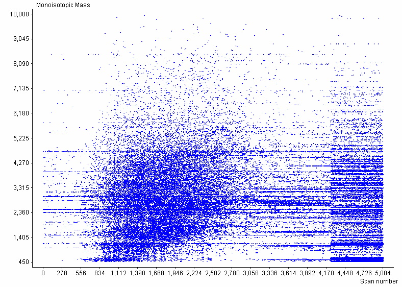

# __VIPER__
VIPER (Visual Inspection of Peak/Elution Relationships) can be used to visualize and characterize the features detected during LC-MS analyses.

### Description
VIPER is primarily intended for processing deisotoped data from high mass measurement accuracy instruments (e.g. FT, TOF, or Orbitrap) and comparing the features found to a list of expected peptides (aka mass and time (MT) tags), as practiced by the AMT tag approach (see Zimmer, Monroe, Qian, & Smith, Mass Spec Reviews, 2006, 25, 450-482).

The software allows one to display the data as a two-dimensional plot of spectrum number (i.e. elution time) vs. mass. It can read MS data from several file formats: .PEK, .CSV ([Decon2LS](https://pnnl-comp-mass-spec.github.io/DeconTools/) format), .mzXML, and .mzData. See the Readme.txt file installed with VIPER for additional details on the various file formats. VIPER runs on Windows computers and requires Microsoft Access be installed to create and edit the MT tag databases.

The "[Data Extraction and Analysis for LC-MS Based Proteomics](https://panomics.pnnl.gov/training/workshops/)" sessions at the 2007 and 2009 US HUPO conferences discussed the use of VIPER for processing example LC-MS datasets and matching to an AMT tag database.  Note also that the [MTDB Creator software](https://pnnl-comp-mass-spec.github.io/MTDB-Creator/) can be used to generate AMT tag databases in the Microsoft Access file format.

The source code for VIPER is fairly large, but includes a reasonable amount of in-code documentation. If you make any improvements to the algorithms used by VIPER, we would encourage you to send the updated code to us at proteomics@pnl.gov.

### Related Publications
[VIPER: an advanced software package to support high-throughput LC-MS peptide identification.](https://pubmed.ncbi.nlm.nih.gov/17545182/)

### Downloads
* [Latest version](https://github.com/PNNL-Comp-Mass-Spec/VIPER/releases/latest)
* [Source code on GitHub](https://github.com/PNNL-Comp-Mass-Spec/VIPER)
* [Example Data](VIPER_Example_Data.zip)
* [Help File](VIPER_HelpFile_v3.20.pdf)

#### Software Instructions
VIPER Feature Tour

Visualization of mass spectra and ICR-2LS / Decon2LS peak lists:

Allows visualization of LC-MS mass spectra from raw data files and peaks lists from ICR-2LS/ Decon2LS through 2D plots (monoisotopic mass vs. scan number) and call ICR-2LS to display mass spectra from raw data files. Also allows viewing total ion chromatograms (TICs), selected ion chromatograms (SICs) and base peak ion (BPI) plots.

**********************

Feature finding:

Finds LC-MS features (i.e. Unique Mass Classes, UMCs) from MS data, allows a charge state view and the capability to zoom-in to view features and feature details (i.e. median mass, elution time, abundance).

### Acknowledgment

All publications that utilize this software should provide appropriate acknowledgement to PNNL and the VIPER GitHub repository. However, if the software is extended or modified, then any subsequent publications should include a more extensive statement, as shown in the Readme file for the given application or on the website that more fully describes the application.

### Disclaimer

These programs are primarily designed to run on Windows machines. Please use them at your own risk. This material was prepared as an account of work sponsored by an agency of the United States Government. Neither the United States Government nor the United States Department of Energy, nor Battelle, nor any of their employees, makes any warranty, express or implied, or assumes any legal liability or responsibility for the accuracy, completeness, or usefulness or any information, apparatus, product, or process disclosed, or represents that its use would not infringe privately owned rights.

Portions of this research were supported by the NIH National Center for Research Resources (Grant RR018522), the W.R. Wiley Environmental Molecular Science Laboratory (a national scientific user facility sponsored by the U.S. Department of Energy's Office of Biological and Environmental Research and located at PNNL), and the National Institute of Allergy and Infectious Diseases (NIH/DHHS through interagency agreement Y1-AI-4894-01). PNNL is operated by Battelle Memorial Institute for the U.S. Department of Energy under contract DE-AC05-76RL0 1830.

We would like your feedback about the usefulness of the tools and information provided by the Resource. Your suggestions on how to increase their value to you will be appreciated. Please e-mail any comments to proteomics@pnl.gov
